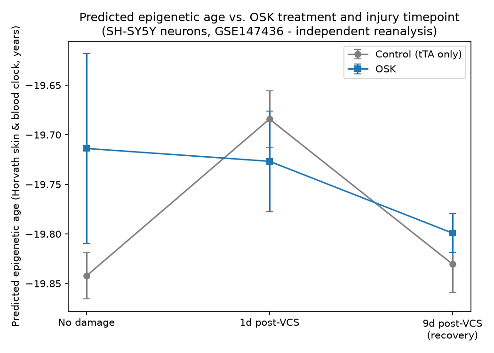

# Independent Reanalysis of GSE147436: DNA Methylation in OSK-Treated Neurons

## Disclaimer

**This is an independent reanalysis of a publicly available dataset, not a
reproduction of the original vision-restoration mouse study.**

David Sinclair's lab (Lu et al., 2020, *Nature*, PMID 33268865) reported that
partial epigenetic reprogramming with the Yamanaka factors Oct4, Sox2, and
Klf4 (together, "OSK") could restore vision in mice with optic nerve damage
and glaucoma. As a mechanistic side experiment, the same paper also profiled
DNA methylation in a human neuron-like cell line (SH-SY5Y) treated with OSK.
That cell-culture methylation data was deposited separately on the NCBI GEO
database as [GSE147436](https://www.ncbi.nlm.nih.gov/geo/query/acc.cgi?acc=GSE147436),
and it is the *only* thing this project analyzes. There is no mouse, vision,
retina, or optic nerve data anywhere in this project. Nothing here confirms
or refutes the vision-restoration findings - it only speaks to methylation
changes in a lab-grown human cell line.

## Background

Epigenetic "clocks" are statistical models that estimate biological age
from DNA methylation patterns at specific genomic positions (CpG sites). The
idea behind this dataset: if OSK reprogramming can make cells "younger" at
the epigenetic level, cells exposed to OSK should show a lower predicted age
than untreated cells, especially after being damaged and left to recover.

The experiment: differentiated SH-SY5Y neurons were engineered with an
inducible OSK system (or a control vector, "tTA," lacking the reprogramming
factors), then some were chemically damaged with vincristine (a drug that
induces the kind of neurite/axon degeneration relevant to the injury model).
Cells were profiled with the Illumina EPIC DNA methylation array at three
points: before damage, one day after damage, and nine days after damage
(a "recovery" window), in both the OSK and control arms, with 3 biological
replicates.

## What we did

Rather than take the original authors' processed numbers at face value, we
reprocessed the experiment from scratch:

1. **Downloaded the raw data** directly from GEO - the actual scanner output
   files (IDATs) for all 24 samples, not just the pre-computed results.
2. **Reprocessed it ourselves** using `methylprep`, an open-source tool that
   performs the standard background correction, dye-bias correction, and
   quality filtering steps for this array platform.
3. **Checked our work** by comparing our independently-computed methylation
   values against the authors' own published values for the same samples.
   Every single sample matched with a correlation of 0.997 or higher,
   confirming our pipeline reproduces the same underlying biological signal.
4. **Applied a published epigenetic clock** - specifically the Horvath 2018
   "skin & blood" clock, a formula built from 391 specific CpG sites with
   published weights, which converts methylation values into a predicted
   age.
5. **Compared OSK-treated vs. control samples** at each of the three
   timepoints, using a statistical test that accounts for which chip/batch
   each sample came from (since batch effects are a common confound in this
   type of data).

Full technical detail is in [docs/data_notes.md](docs/data_notes.md) and
[docs/results_summary.md](docs/results_summary.md); the code is in
[src/](src/) and can be re-run end-to-end.

## Results



| Timepoint | OSK vs. control difference | Statistically significant? |
|---|---|---|
| No damage (baseline) | +0.13 "years" | No (p = 0.18) |
| 1 day post-injury | -0.04 "years" | No (p = 0.40) |
| 9 days post-injury (recovery) | +0.03 "years" | No (p = 0.21) |

**None of these differences reached statistical significance**, and the
direction of the (very small) difference isn't even consistent from one
timepoint to the next.

Two important caveats on interpreting these numbers at all:

- **The predicted ages themselves are not biologically meaningful in
  absolute terms.** SH-SY5Y is an immortalized cancer-derived cell line, not
  normal human tissue, so its overall methylation landscape looks nothing
  like what the clock was trained on. All samples came out around -19.7
  "years" - obviously not a literal age. Only the *relative* comparison
  between conditions is potentially informative, and that's what's reported
  above.
- **Only 3 biological replicates per group.** With so few samples, this
  analysis has very limited power to detect a real but modest effect. A
  "no significant difference" result here should be read as *inconclusive*,
  not as strong evidence of *no effect*.

## Interpretation

Using our own independent processing pipeline and one specific, published
epigenetic clock, we do not find a clear or statistically significant shift
in predicted methylation age attributable to OSK treatment in this dataset.

This is **not** a refutation of the original study. The original paper may
have used different statistical approaches, different metrics, or drawn on
additional lines of evidence (including the in-vivo mouse results, which are
entirely outside the scope of this project) that this reanalysis doesn't
touch. What this project shows is narrower and more specific: *starting from
the raw public data and applying one common, independently-implemented
analysis pipeline, the epigenetic-age-reversal signal in this particular
cell-culture dataset is small, inconsistent in direction, and not
statistically distinguishable from noise given the sample size available.*

## Reproducing this analysis

See [README.md](README.md) for environment setup instructions. Once set up,
the pipeline runs in order:

```bash
.venv/bin/python src/build_sample_sheet.py
.venv/bin/python src/run_pipeline.py
.venv/bin/python src/crosscheck_betas.py
.venv/bin/python src/compute_epigenetic_age.py
.venv/bin/python src/compare_groups.py
```
